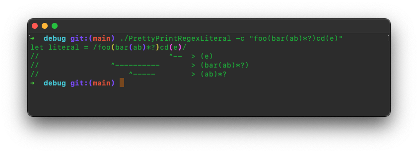

# Pretty Print Regex Literal
## A command line tool to pretty print regex literals.

---
## Usage:
`$PrettyPrintRegexLiteral <literal>`

### Flags:
- `-c` / `--colored`: Colorcode matching parenthesis
  
